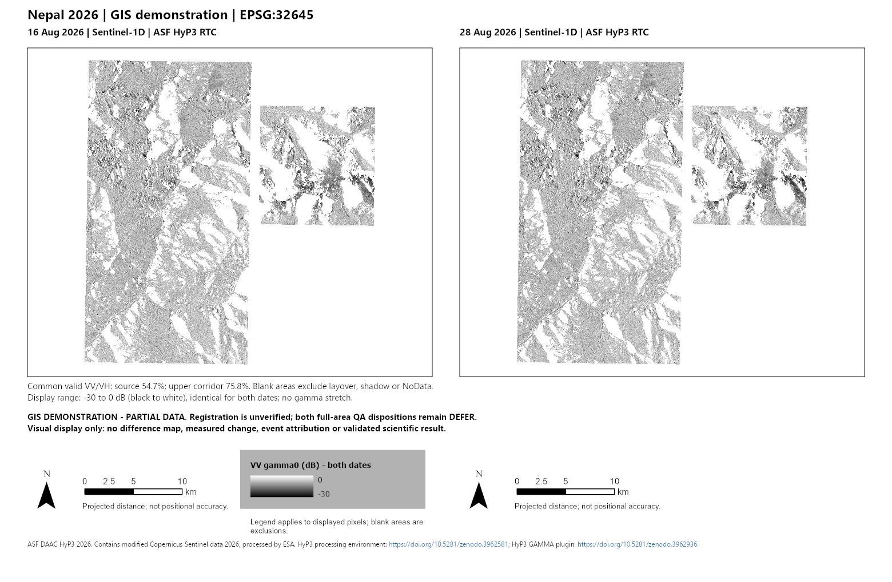

# Nepal 2026 Before/After Map

An independent GIS project using satellite imagery around the 26 August 2026 Nepal event. **The current deliverable is an unverified GIS experiment for visual exploration.**

## Available demonstration — 5 October 2026

**Interactive inspection:** the [local Leaflet swipe viewer](docs/viewer/index.html) uses higher-resolution renders with synchronized zoom/pan, a draggable boundary, date-only modes and optional blinking. Run it through the local-server instructions; GitHub's file view does not execute HTML. See [viewer instructions](docs/GIS_SWIPE_VIEWER.md).

Presentation work continues under the experiment scope. Scientific verification and public CI are not presentation release gates; routine checks keep the files usable and the dates and credits accurate. The viewer keeps one short experiment label, with technical details in expandable notes.

**ArcGIS companion:** the viewer's **Download ArcGIS layers** button packages the two existing full-extent display images with projected placement, dates and credits. Extract the ZIP and add both PNGs to one map. These are display layers; the editable project and cartographic exports remain in the local handoff.



The panel displays **16 and 28 August 2026 Sentinel-1D ASF HyP3 RTC VV gamma0 imagery**, in **WGS 84 / UTM zone 45N (EPSG:32645)**. It uses a shared -30 to 0 dB display scale. Blank areas are exclusions, not evidence of no landscape change.

The local ArcGIS handoff includes an editable project, display GeoTIFFs, a source table, PNG/PDF exports and packages. See the [demonstration guide](docs/GIS_DEMONSTRATION.md) for paths and recorded checks.

<details>
<summary>Package checks and technical history</summary>

- An owner-local APRX, two display GeoTIFFs, source-manifest table, PNG/PDF exports and ZIP handoff have passed same-machine copied-folder and extracted-ZIP reopen/export tests.
- The original display rasters are unchanged, and the ZIP exports match the working layout exactly.
- A fifth PPKX test, using internal packaging with strictly local inputs, preserved the original GeoTIFF bytes and passed fresh-process reopen/render checks at two extraction locations. Four earlier PPKX failures remain retained evidence.
- The latest fresh-copy layout adds linked true-north arrows, kilometer scale bars and a shared native legend. Its PPKX passes the same checks at two extraction locations; map viewports and imagery are unchanged. A failed cartographic preview remains retained.
- Registration is unverified; source-area and upper-corridor common-valid coverage remain **54.6721%** and **75.7928%**. Both full-area QA dispositions remain `defer`.

</details>

Read the [demonstration guide](docs/GIS_DEMONSTRATION.md), [initial ZIP result](records/readiness/gis-demonstration-001-result.json), [preserved-format PPKX result](records/readiness/gis-demonstration-001-ppkx-preserved-format-result.json) and [cartographic result](records/readiness/gis-demonstration-001-cartography-result.json). Large GIS files stay outside Git. Source archives, DEM rasters, credentials and private correspondence are not distributed here.

Image credit: **ASF DAAC HyP3 2026. Contains modified Copernicus Sentinel data 2026, processed by ESA.** HyP3 processing environment: [10.5281/zenodo.3962581](https://doi.org/10.5281/zenodo.3962581); GAMMA plugin: [10.5281/zenodo.3962936](https://doi.org/10.5281/zenodo.3962936). The demonstration guide records the intended-use rights review. Public visibility does not relicense third-party material or imply agency endorsement.

## What remains scientific work

The original research objective and acceptance contracts remain preserved. No registered difference, reviewed change feature, geomorphic interpretation or event attribution has been admitted. The demonstration does not turn failed optical/radar routes into passes, resolve independent reference or terrain uncertainty, establish clean-machine portability, or complete the original M5/M6 scientific delivery.

The current demonstration is useful for inspecting projected imagery, editing an ArcGIS layout, tracing source identity and dates, exporting maps, and examining package failures honestly. Earlier progress prose is retained in Git history; it should not be treated as current runtime state.

## Reproduce and inspect

ArcGIS Pro 3.7.1 was used for the real map tests. The [guide](docs/GIS_DEMONSTRATION.md) explains the verified inputs, staging scripts, limitations and local handoff formats. No new download or credential is needed for the existing-output demonstration.

Portable checks:

```powershell
python scripts/check_project.py
python -m unittest discover -s tests -p test_stage_gis_demonstration_001.py -v
```

Repository checks validate control integrity and software tests; they do not validate private imagery or scientific claims. The source raster and local runtime evidence are separately bound in the result record.

## Project history and methods

- [Project charter](docs/PROJECT_CHARTER.md)
- [Roadmap and original milestones](docs/ROADMAP.md)
- [Data and methods plan](docs/DATA_AND_METHODS_PLAN.md)
- [Source register](docs/SOURCES.md)
- [M1 AOI review](docs/M1_AOI_REVIEW.md)
- [M1 source manifest review](docs/M1_SOURCE_MANIFEST_REVIEW.md)
- [ArcGIS evidence schema](docs/ARCGIS_EVIDENCE_MODEL.md)
- [Original final scientific acceptance](docs/ARCGIS_FINAL_DELIVERY_ACCEPTANCE.md)

This is a demonstration release path alongside the retained scientific history. A future scientific result would require new supported evidence and explicit method/review scope, not removal of the qualifications above.
