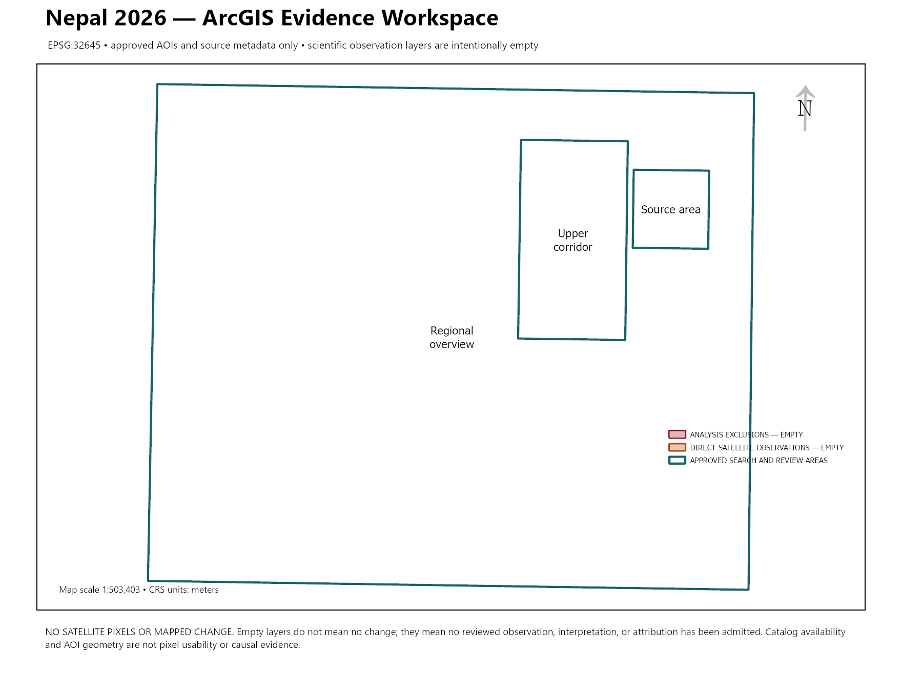

# ArcGIS evidence model

## Purpose

The ArcGIS evidence workspace is the editable structure for later before/after analysis. It prevents direct satellite observations, analyst interpretation, and event attribution from collapsing into one feature class or one unsupported map claim.

The current workspace contains approved AOIs and ten source-product metadata rows. All scientific evidence layers are empty by design because no full products, masks, registered pixels, or reviewed change observations exist yet.



## Evidence layers

| Dataset | Role | Current rows |
|---|---|---:|
| `StudyAreas` | Three owner-approved search and review AOIs | 3 |
| `SourceProducts` | Exact Sentinel identities, dates, dispositions, rights, custody, and pixel status | 10 |
| `ObservedChange` | Directly measurable optical, radar, water-extent, or multisensor change | 0 |
| `ObservationSources` | Many-to-many links between observations and exact products | 0 |
| `AnalysisExclusions` | Cloud, snow, shadow, layover, nodata, misregistration, rights, and other exclusions | 0 |
| `StableControls` | Registration and stable-reference control points | 0 |
| `Interpretations` | Possible geomorphic meaning assigned to an admitted observation | 0 |
| `AttributionAssessments` | Separate assessment of timing, geometry, independent evidence, and causal support | 0 |
| `AnalysisQA` | Registration, mask, coverage, rights, container, and stable-reference tests | 0 |

Eight relationship classes preserve AOI, source, observation, interpretation, attribution, exclusion, and QA lineage. Fourteen coded-value domains retain accepted, rejected, deferred, inconclusive, invalid, and superseded states alongside confidence and review status.

## Claim boundary

`ObservedChange` may contain satellite-observed measurements only. A possible debris deposit, source scar, channel change, inundation, or bank erosion belongs in `Interpretations`. Any statement connecting an interpretation to the 26 August event belongs in `AttributionAssessments` and must preserve timing, geometry, independent evidence, limitations, and review state.

Empty layers mean no reviewed evidence has been admitted. They do not mean the landscape did not change.

## Verified ArcGIS surface

ArcGIS Pro 3.7.1 Advanced created and reopened:

- an EPSG:32645 File Geodatabase with nine datasets;
- fourteen coded-value domains;
- eight relationship classes;
- an editable APRX with a projected map, five standalone tables, and an overview layout;
- PDF and PNG exports from the same layout.

The retained APRX, geodatabase, and PDF remain in ignored scratch custody. The PNG preview is public because it contains only approved AOI geometry, source-metadata context, empty evidence layers, and an explicit no-scientific-claim notice.

The default ArcGIS scale-bar surround failed two visual attempts and remains preserved in the receipt. The scaffold uses a verified numeric map scale and projected units instead. A true scale bar remains mandatory for each later scientific layout and must be tested against that layout's final extent.

## Rebuild and validation

ArcGIS Pro is required:

```powershell
& "C:\Program Files\ArcGIS\Pro\bin\Python\Scripts\propy.bat" scripts\build_arcgis_evidence_workspace.py `
  --template "C:\Program Files\ArcGIS\Pro\Resources\ArcToolBox\Services\routingservices\data\Blank.aprx" `
  --output-root scratch\arcgis-evidence-workspace-NEW-ATTEMPT `
  --public-preview docs\assets\arcgis-evidence-workspace-preview-NEW.png `
  --receipt-output records\surface-receipts\arcgis-evidence-workspace-NEW.json `
  --verified-at-utc 2026-09-02T00:00:00Z

& "C:\Program Files\ArcGIS\Pro\bin\Python\Scripts\propy.bat" scripts\validate_arcgis_evidence_workspace.py
```

Use new output names. The builder refuses replacement and retains failed attempts rather than rewriting them as passes.
