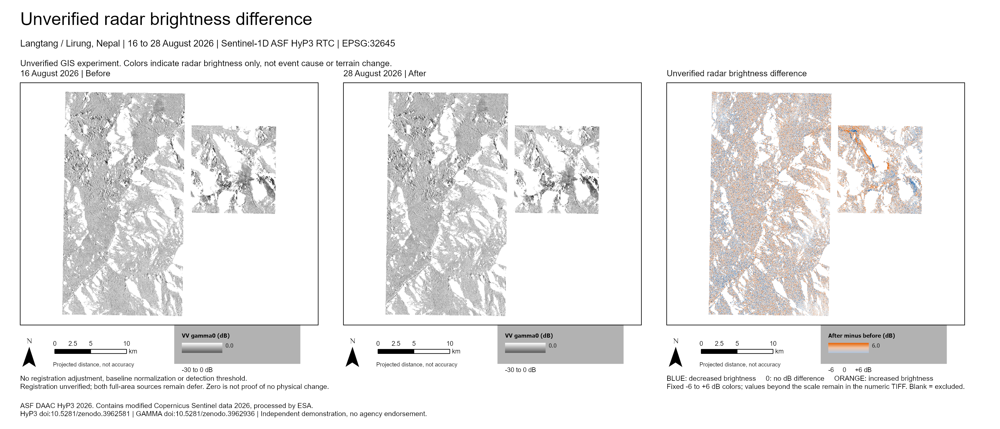

# Unverified radar brightness difference

The [local projected viewer](viewer/index.html#view=difference) now has a **Brightness difference** button alongside swipe, date-only and blink views. Blue means decreased radar brightness; orange means increased brightness. This is an unverified GIS experiment, not a hazard map or an attribution of event effects.



## Method

Only two existing Float32 dB TIFFs are used: **M1-SRC-002, 16 August 2026**, and **M1-SRC-005, 28 August 2026**, Sentinel-1D ASF HyP3 RTC VV gamma0. Their original bytes remain unchanged. The calculation subtracts TIFF values, not PNG colors:

```text
delta_vv_db = after_vv_db - before_vv_db
```

The inputs share a north-up **EPSG:32645**, 2,980 by 3,126 cell grid with 10 m posting. Finite values from both inputs are required. Existing NaN/NoData remains excluded; a separate byte TIFF records **0 = included, 1 = either input invalid**. It covers the existing input rectangle, including the original gaps, and is not an event boundary.

The numeric difference is preserved as Float32 with NaN NoData. Values are **not clipped**. The fixed **−6 to +6 dB** blue/neutral/orange display is centered on zero; values outside it receive endpoint colors. This is a display scale, not a detection threshold. No registration adjustment, filtering, warping or baseline normalization was applied. Zero is not proof of no physical change.

The browser difference PNG was exported by ArcGIS with the same camera and frame size as the two existing native renders. All three have identical 3,540 by 2,880 display grids and identical native world-file coefficients. Their approximately 11.72 m render sampling is distinct from the 10 m numeric grid. Changing viewer modes does not refit or align imagery.

Registration remains unverified. Radar brightness can vary with geometry, moisture, scattering, speckle or misalignment. Both original full-area QA dispositions remain `defer`; the retained scientific method and final-delivery contracts are not satisfied or rewritten by this experiment.

## ArcGIS and exports

The owner-local handoff contains an editable APRX with **three maps**, one 19.8 by 8.5 inch comparison layout, four layer files, the original date TIFFs, numeric `delta_vv_db.tif`, `excluded_cells.tif`, a two-row source table, local writable default geodatabase/toolbox, and PNG/PDF exports. Exclusions are available as a separate layer and are off by default, so the difference map retains blank gaps.

The PPKX preserves all four TIFFs and reopens after extraction in a fresh ArcGIS process with matching cell digests, grid metadata, source table and rendered layout. The test is **same machine, ArcGIS Pro 3.7.1**; clean-machine, clean-profile and cross-version behavior was not tested. Large numeric files and GIS packages stay outside Git. The exact identities and package result are in the [sanitized result](../records/readiness/gis-demonstration-001-brightness-difference-result.json).

The browser's **Download date display layers** button still exports the two original date PNG displays only. It does not include numeric difference data. Use the local APRX/PPKX handoff for the editable difference layer and exportable layout. See the [viewer opening instructions](GIS_SWIPE_VIEWER.md).

## Reproduction with the exact existing inputs

Use the installed ArcGIS Python and new disjoint output folders. The scripts refuse input identity/grid drift and do not acquire new imagery. `$RasterRoot` is the existing exact before/after TIFF folder; `$RenderProject` is the existing cartography-003 APRX matching the pinned rendering-project hash. These local inputs are not downloaded by the public repository.

```powershell
& $ArcGISPython scripts/gis_brightness_difference_001.py derive --rasters $RasterRoot --output $NewCalculationFolder
& $ArcGISPython scripts/gis_brightness_difference_001.py sign-probe --output $NewDisposableProbeFolder
& $ArcGISPython scripts/gis_brightness_difference_001.py build --project $RenderProject --rasters $RasterRoot --calculation $NewCalculationFolder --output $NewArcGISFolder
& $ArcGISPython scripts/arcgis_demo_roundtrip.py run --project "$NewArcGISFolder/Nepal_Unverified_Brightness_Difference.aprx" --source-root $NewArcGISFolder --output $NewRoundtripFolder --sharing INTERNAL
```

Retain failed outputs when correcting mechanics. Initial stops involved a rendering-project hash paired with a relocated-project path, an unsupported Python deep-copy of an ArcGIS camera, and a newly generated toolbox XML sidecar during packaging. Corrected fresh outputs pass; no source TIFF changed. Portable and installed-runtime focused tests each pass 27 tests. A generated −6 / 0 / +6 dB native-render probe confirms the displayed sign. Browser checks cover mode switching without camera movement, identical overlay placement, URL restoration, zoom, keyboard swipe, mobile layout, and loss of the difference image while preserving both date views. The PDF was separately rendered and visually reviewed. These checks establish calculation and presentation mechanics, not scientific validation.

## Credits and implementation reference

ASF DAAC HyP3 2026. Contains modified Copernicus Sentinel data 2026, processed by ESA. HyP3: [10.5281/zenodo.3962581](https://doi.org/10.5281/zenodo.3962581); GAMMA: [10.5281/zenodo.3962936](https://doi.org/10.5281/zenodo.3962936). Independent demonstration; no agency endorsement.

Native raster presentation uses the [Esri RasterStretchColorizer](https://doc.esri.com/en/arcgis-pro/latest/arcpy/mapping/rasterstretchcolorizer-class.html) and fixed custom CIM limits. Existing imagery rights and provenance remain in the [demonstration guide](GIS_DEMONSTRATION.md). No new imagery, account, credential, terms acceptance, installation or external basemap is required.
