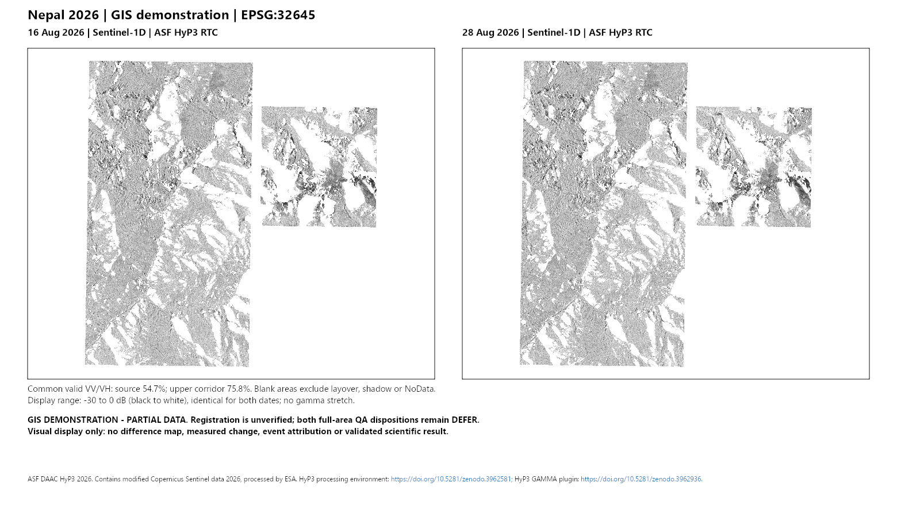

# Nepal imagery: a GIS workflow demonstration

This is an independent, unofficial GIS demonstration. It shows existing satellite imagery and an ArcGIS workflow; it does **not** identify validated landscape change or attribute a feature to the 26 August 2026 event. It is not an operational hazard map.



## What the panel contains

| Item | Before | After |
|---|---|---|
| Acquisition | 16 August 2026 | 28 August 2026 |
| Sensor | Sentinel-1D | Sentinel-1D |
| Source ID | M1-SRC-002 | M1-SRC-005 |
| Processing | ASF HyP3 RTC VV gamma0, displayed in dB | Same |
| Project CRS | WGS 84 / UTM zone 45N, EPSG:32645 | Same |
| Posting | 10 m | 10 m |

The displayed rasters were already generated under the earlier local visual route. Demonstration staging copies their bytes unchanged. It does not recalibrate, filter, warp, register, threshold or compute a difference between them. Posting is not a claim of 10-m positional accuracy.

The new demonstration uses the same fixed grayscale display range, **-30 to 0 dB**, for both dates, with no gamma stretch. This replaces the original panel's automatic percentile display to avoid histogram-dependent rendering when ArcGIS consolidates the TIFFs into a geodatabase. It changes presentation only; source raster values and scientific criteria remain unchanged. A shared display scale does not establish radiometric normalization or registration.

The common valid VV/VH area is **54.6721% of the source-area AOI** and **75.7928% of the upper-corridor AOI**. The panel displays VV only. Blank areas represent exclusions for layover, shadow or NoData; they do not demonstrate an unchanged surface. The fractions use the original full-AOI denominators, and both full-area QA dispositions remain `defer` under the original 80% rule. Residual registration is unverified. Brightness differences can reflect radar geometry, moisture, scattering, speckle or alignment rather than event effects.

## Demonstration deliverables and verification

The owner-local working directory holds an editable APRX, two copied display GeoTIFFs, a source-manifest table, writable project defaults, PNG/PDF exports and package-test evidence. A PPKX is deliverable only after extraction and fresh-process reopen tests pass. Large GIS artifacts remain outside Git.

The repository contains the staging and package-test code, rights review, qualified preview when verified, and a sanitized result. Tests establish the recorded local mechanics, not scientific validity. Same-machine testing is not a clean-machine or cross-version acceptance test. This demonstration does not mark the original M5/M6 scientific acceptance criteria complete.

### Verified result on 5 October 2026

The working handoff is a **ZIP retaining the original display GeoTIFFs**, not a PPKX. Its CRC and 65 manifest-file hashes pass, and copies at two new folder locations reopen with matching map structure, full-cell digests and rendered exports. Home folder, default geodatabase, toolbox and operational sources resolve inside the extracted folder. The owner-local ZIP is 43,547,880 bytes, SHA-256 `55b483b03358635757e857f7ee8e7d94bc496cb7103dc0346fd0792fdd6a7098`.

Four PPKX failures remain retained. The first exposed an omitted empty default geodatabase; the second exposed a standalone-table adapter error. After those corrections, both later candidates preserved the geometry, cell values and source table but failed exact rendered-export parity. Adding a common display scale did not resolve that mismatch. The PPKXs are candidates, not the verified delivery. No scientific source was reacquired or reprocessed to make this demonstration.

See the [sanitized result](../records/readiness/gis-demonstration-001-result.json). Public CI verifies repository controls and software tests, not private GIS data. The local demonstration proof is the separate ArcGIS runtime record.

## Reproduce with your local verified inputs

ArcGIS Pro 3.7.1 was used. No cloud basemap, account, new download or installation is needed for these steps. The staging script checks the exact accepted hashes before it writes a new directory. Inputs must be the previously verified local panel rasters and repaired project, not substitute scenes.

```powershell
& $ArcGISPython scripts/stage_gis_demonstration_001.py `
  --project $VerifiedRepairedProject --rasters $VerifiedPanelFolder `
  --output $NewStagingFolder

& $ArcGISPython scripts/arcgis_demo_roundtrip.py run `
  --project "$NewStagingFolder/Nepal_GIS_Demonstration.aprx" `
  --source-root $NewStagingFolder --output $NewRoundtripFolder
```

Use new output folders. Preserve failed receipts; do not overwrite an existing attempt. Inspect the exported layout visually before sharing it. The staging script gives the project local writable defaults and includes two provenance rows in `SourceManifest`. The round-trip verifier rejects broken, remote or out-of-tree operational sources, checks the packaged structure and rendered pixels, and records file-identity changes.

The verifier also compares full-cell digests, NoData-normalized array shapes, projected extents and presentation settings for each existing display raster before and after packaging. This is within-source packaging validation, not a before/after change calculation.

## Rights, credits and privacy

Public access alone is not a redistribution permission. The exact two provider VV metadata files allow credited use. The intended demonstration use was separately reviewed; the previously generated DEM is excluded. ASF requests product-specific acknowledgements and DOIs for publications and presentations ([ASF guidance](https://hyp3-docs.asf.alaska.edu/usage_guidelines/)). The underlying Sentinel notice permits lawful adaptation and public communication with the source/modification notice ([Copernicus notice](https://sentinels.copernicus.eu/documents/247904/690755/Sentinel_Data_Legal_Notice)).

Image credit: **ASF DAAC HyP3 2026. Contains modified Copernicus Sentinel data 2026, processed by ESA.**

Processing environment: [10.5281/zenodo.3962581](https://doi.org/10.5281/zenodo.3962581). GAMMA plugin: [10.5281/zenodo.3962936](https://doi.org/10.5281/zenodo.3962936).

Public material excludes credentials, account details, private correspondence, the owner's private planning context and restricted ancillary rasters. Code licensing does not relicense third-party imagery. The original failed, inconclusive and deferred routes remain in the evidence history; this demonstration changes the presentation purpose, not those outcomes.
