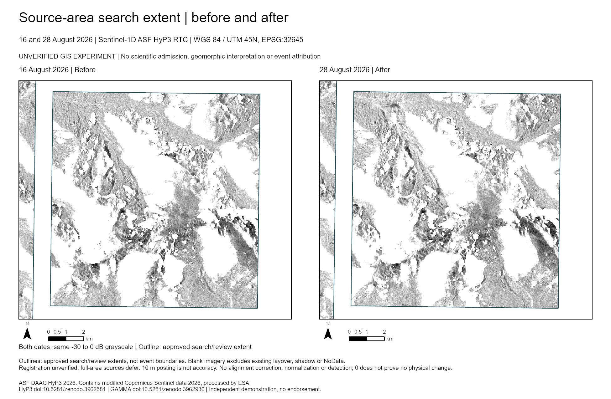
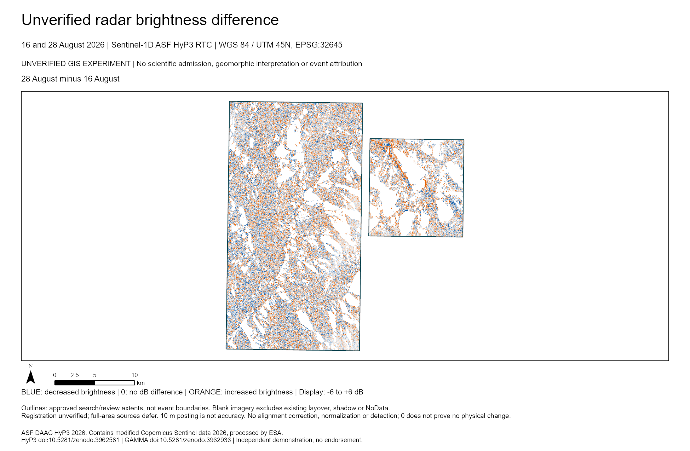

# Five-map ArcGIS atlas

**Unverified GIS experiment:** five editable map views of the existing 16 and 28 August 2026 Sentinel-1D ASF HyP3 RTC imagery. All maps use WGS 84 / UTM zone 45N, **EPSG:32645**.

For closer comparison, use the [Leaflet viewer](GIS_SWIPE_VIEWER.md), with swipe, blink and brightness-difference modes. The atlas provides printable views and native ArcGIS layers alongside that viewer.



## The five views

| Layout | What it shows |
|---|---|
| `regional_overview` | Approved regional search/review extent and available imagery; no added basemap |
| `source_area_comparison` | Two dated views centered on the approved source-area search extent |
| `upper_corridor_comparison` | Two dated views centered on the approved upper-corridor search extent |
| `evidence_map` | Existing unverified after-minus-before VV brightness difference |
| `limitations_map` | Existing included/excluded cells and the blank area outside the input grid |

Each layout includes dates, CRS, a legend explanation, linked kilometer scale bars and true-north arrows, source credits and the experiment label. The outlines are approved **search/review extents, not event perimeters**. No settlements, roads, impact footprints or landscape-change features are invented.

## Open and export

The latest owner-local handoff is `Nepal_Unverified_Atlas_Evidence.zip`, described in the [offline evidence catalog guide](GIS_EVIDENCE_CATALOG.md). The original `Nepal_Unverified_Atlas.zip` remains preserved. Extract the entire bundle to a writable folder and open **`Nepal_Unverified_Atlas.ppkx`** in ArcGIS Pro. Let Pro unpack the project to a writable location; do not extract under Program Files.

In the Catalog pane, expand **Layouts**, open a layout, and use **Share → Export Layout**. The project contains five principal maps and two supporting dated maps. Existing PDF/PNG exports are in the bundle's `exports` folder.

The bundle also includes four unchanged GeoTIFFs, five `.lyrx` files, `Experiment.gdb`, `ExperimentMetadata.gpkg`, method notes and an artifact manifest. To add a standalone layer, open one of the `.lyrx` files. Keep `layers`, `imagery` and `Experiment.gdb` together: the layer files use relative connections. The GeoPackage holds three approved projected study polygons, two displayed-source rows and one method row. It contains no claimed event-change geometry.

The large GIS bundle stays outside Git. The [sanitized result](../records/readiness/gis-demonstration-001-atlas-result.json) identifies the package, exports and bundle by hashes.

## Read the colors



Both dated images use the same fixed **−30 to 0 dB** grayscale. The difference is the previously calculated **28 August minus 16 August** value. Blue is lower, orange is higher; its display spans **−6 to +6 dB**. Stored values remain unclipped. The atlas does not calculate, clip, warp, filter or resample a new analysis raster.

On the limitations map, teal means both existing inputs have valid values; gray means either input is invalid. White outside the original grid has no observation. Those gaps are not evidence of no physical change.

<details>
<summary>Method limits and checks</summary>

Registration remains unverified. Brightness can differ because of alignment, radar geometry, moisture, scattering or speckle. There is no registration correction, normalization, thresholded detection, geomorphic interpretation or event attribution. The original full-area source dispositions remain `defer`; 10 m posting is not 10 m positional accuracy. The original M4–M6 scientific acceptance requirements remain unmet.

The handoff is tested in ArcGIS Pro 3.7.1 on the same machine, including fresh-process extraction, reopen and re-export. This does not establish clean-machine, clean-profile or cross-version portability. Five native PNG exports and five separately rendered PDFs are visually inspected. Earlier synthetic and cartographic faults remain retained rather than overwritten. Repository tests and CI are routine engineering checks, not scientific verification or presentation-release gates.

The generic package checker retained a failed strict-schema receipt because packaging moved the system `Shape_Length` and `Shape_Area` fields after the named attributes. A separate atlas check compares the exact field names and types independent of order, and additionally verifies polygon coordinates and named attributes. It passes along with exact raster bytes and rendered maps. The original strict receipt is unchanged; the scientific rules are not altered.

</details>

## Reproduce from the same existing outputs

Use the exact existing brightness-difference project and four TIFFs described in [the difference guide](GIS_BRIGHTNESS_DIFFERENCE.md). The build verifies their identities and the unchanged approved M1 projected AOI JSON before copying to a fresh directory.

```powershell
& $ArcGISPython scripts/gis_experiment_atlas_001.py `
  --source-root $ExistingBrightnessProjectFolder `
  --aoi config/aoi/approved-study-areas-epsg32645.json `
  --output $NewAtlasFolder

& $ArcGISPython scripts/arcgis_demo_roundtrip.py run `
  --project "$NewAtlasFolder/Nepal_Unverified_Atlas.aprx" `
  --source-root $NewAtlasFolder --output $NewPackageTestFolder --sharing INTERNAL

& $ArcGISPython scripts/package_gis_experiment_atlas_001.py --verify-package `
  --source-root $NewAtlasFolder --roundtrip $NewPackageTestFolder

& $PortablePython scripts/package_gis_experiment_atlas_001.py `
  --source-root $NewAtlasFolder --roundtrip $NewPackageTestFolder `
  --output $NewBundleFolder
```

Use new output directories and retain earlier results. The complete ZIP includes a README and per-file SHA-256 manifest; its extraction is checked against the bundle's file identities. This packaging is for the existing unverified experiment, not a scientific M6 acceptance run.

## Credits

**ASF DAAC HyP3 2026. Contains modified Copernicus Sentinel data 2026, processed by ESA.** HyP3: [doi:10.5281/zenodo.3962581](https://doi.org/10.5281/zenodo.3962581). GAMMA: [doi:10.5281/zenodo.3962936](https://doi.org/10.5281/zenodo.3962936). Independent demonstration; no endorsement. The unchanged-source rights review is recorded in [the demonstration guide](GIS_DEMONSTRATION.md).
