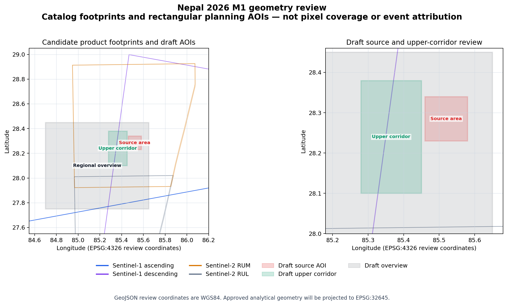

# M1 AOI review bundle

## Decision requested

Review the three rectangular planning areas and choose one disposition:

1. **Approve as M1 search and review AOIs.** These bounds will constrain source discovery and initial ArcGIS organization but will not become final mapped change polygons.
2. **Revise.** Provide replacement bounds or describe which edge should move.
3. **Defer.** Keep the geometry in draft state and do not prepare an acquisition manifest.

Approval must bind the exact AOI GeoJSON SHA-256:

`68c406f7f41c301c339e200ccdd75194183c483c65156ab3949e64236072ccde`

Approval does not authorize full-product downloads, credentials, terms acceptance, restricted imagery, scientific conclusions, or operational use.

## Draft geometry

| AOI | Bounds in WGS84 | Intended role |
|---|---|---|
| Regional overview | 84.70–85.65 E, 27.75–28.45 N | Regional source-to-downstream context |
| Source area | 85.46–85.58 E, 28.23–28.34 N | Candidate debris-avalanche source and immediate path |
| Upper corridor | 85.28–85.45 E, 28.10–28.38 N | Candidate Bhote Koshi–Trishuli change corridor |

The review geometry is stored as RFC 7946 GeoJSON in EPSG:4326. If approved, analytical copies will be projected to WGS 1984 UTM Zone 45N, EPSG:32645.

## Catalog and quicklook findings

- All ten exact Sentinel names returned one public Copernicus record with a provider UUID, acquisition date, attributes, checksums, and footprint.
- All ten public quicklook assets were available and decoded without credentials.
- Sentinel-2 tile `45RUM` intersects the draft source and upper-corridor bounding boxes. Tile `45RUL` does not; it remains a regional-context candidate.
- The first ascending Sentinel-1 slice in each date pair does not intersect the source or corridor bounding boxes; the following slice does. Both slices remain recorded so swath continuity is not silently changed.
- The 27 August Sentinel-2 RUM candidate has catalog cloud cover of 78.471315 percent and is visibly cloud or bright-cover limited in its quicklook.
- The 27 August Sentinel-2 RUL candidate has catalog cloud cover of 54.286689 percent and is also visibly cloud or bright-cover limited.
- Sentinel-1 quicklooks confirm coarse swath coverage but are too small and terrain-dominated for event-scale change interpretation.

These are screening findings. They do not establish usable pixels, correct masks, co-registration, quantitative change, or event causation.

## Source and rights boundary

The Copernicus source gate is structurally valid and ready for public metadata review and private scratch quicklook screening. Sentinel data use is subject to the Sentinel Data Legal Notice and required source notices. Portal quicklook assets are not redistributed from this repository.

Full-product access requires a separately gated authenticated workflow and is outside the active M1 authority.

## Bound evidence

| Evidence | SHA-256 |
|---|---|
| Draft AOI GeoJSON | `68c406f7f41c301c339e200ccdd75194183c483c65156ab3949e64236072ccde` |
| Catalog metadata | `0e7d57f007933844b927f08569de03097ac60f1f5f1edda212e2027aef332c7c` |
| Candidate footprints | `4a0ecec9d76c4d4d7585442cdb193142621a911929b8588ef37fc5a6d9b20ff1` |
| Quicklook review | `f6dd95475cb515c6748173d3c84561c7fd19dcf8a118982d9b8957ade236a619` |
| Review map | `dea0f27e4fb9440a72ff11dc2da046f16e0aa1ebf46cb02b3095c2805432ce0d` |

## Current state

`M1-AOI` is a human gate. No AOI approval record exists yet. `M1-MANIFEST` remains downstream and cannot become ready until the AOIs are approved.
