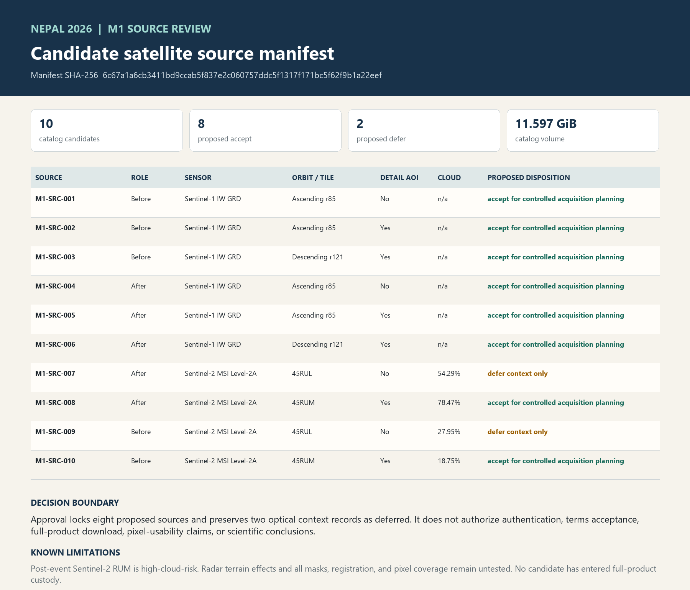

# M1 source-manifest review

## Decision requested

Review the exact candidate manifest and choose **approve**, **revise**, or **defer**. Approval locks the proposed source set for later controlled acquisition planning. It does not authorize credentials, terms acceptance, or downloads.

- **Manifest:** `NEPAL-M1-CANDIDATE-SOURCE-MANIFEST-001`
- **Manifest SHA-256:** `6c67a1a6cb3411bd9ccab5f837e2c060757ddc5f1317f171bc5f62f9b1a22eef`
- **AOI approval:** `92ce0094460968ae37c1687cc0dde5e5db439b0dd968a3161d7d4feb3a6e93aa`
- **Proposed accepted:** 8
- **Proposed deferred:** 2
- **Proposed rejected:** 0
- **Accepted catalog volume:** 11.597 GiB

## Candidate decisions

| Source | Role | Sensor | Orbit/tile | Detailed AOI | Cloud | Proposal | Catalog size |
|---|---|---|---|---|---:|---|---:|
| `M1-SRC-001` | before | Sentinel-1 IW GRD | ASCENDING r85 | no | n/a | `accept_for_controlled_acquisition_planning` | 1.613 GiB |
| `M1-SRC-002` | before | Sentinel-1 IW GRD | ASCENDING r85 | yes | n/a | `accept_for_controlled_acquisition_planning` | 1.614 GiB |
| `M1-SRC-003` | before | Sentinel-1 IW GRD | DESCENDING r121 | yes | n/a | `accept_for_controlled_acquisition_planning` | 1.600 GiB |
| `M1-SRC-004` | after | Sentinel-1 IW GRD | ASCENDING r85 | no | n/a | `accept_for_controlled_acquisition_planning` | 1.613 GiB |
| `M1-SRC-005` | after | Sentinel-1 IW GRD | ASCENDING r85 | yes | n/a | `accept_for_controlled_acquisition_planning` | 1.614 GiB |
| `M1-SRC-006` | after | Sentinel-1 IW GRD | DESCENDING r121 | yes | n/a | `accept_for_controlled_acquisition_planning` | 1.600 GiB |
| `M1-SRC-007` | after | Sentinel-2 MSI Level-2A | 45RUL | no | 54.29% | `defer_context_only` | 0.813 GiB |
| `M1-SRC-008` | after | Sentinel-2 MSI Level-2A | 45RUM | yes | 78.47% | `accept_for_controlled_acquisition_planning` | 0.877 GiB |
| `M1-SRC-009` | before | Sentinel-2 MSI Level-2A | 45RUL | no | 27.95% | `defer_context_only` | 0.854 GiB |
| `M1-SRC-010` | before | Sentinel-2 MSI Level-2A | 45RUM | yes | 18.75% | `accept_for_controlled_acquisition_planning` | 1.064 GiB |

## Proposed route

- Retain all six Sentinel-1 GRD records so the ascending two-slice pairs and descending single-slice pairs remain complete for later terrain and pixel QA.
- Retain the Sentinel-2 RUM before/after pair because it intersects both detailed AOIs. The post-event tile remains high-cloud-risk and may prove inconclusive.
- Defer both Sentinel-2 RUL records because they intersect only the regional overview bounding box and add cloud-limited context rather than event-area pixels.
- Reject none at this stage; deferred and potentially unusable observations remain in the evidence record.

## Evidence boundary

This manifest records product identities, dates, footprints, catalog checksums, quicklook screening, access boundaries, and proposed dispositions. No full product has been downloaded. Pixel coverage, masks, registration, radar geometry, and change evidence remain untested.

## Required owner response

Approval must bind manifest SHA-256 `6c67a1a6cb3411bd9ccab5f837e2c060757ddc5f1317f171bc5f62f9b1a22eef` and explicitly attest that the decision is complete. Revision should identify exact source IDs or the acquisition boundary to change.
