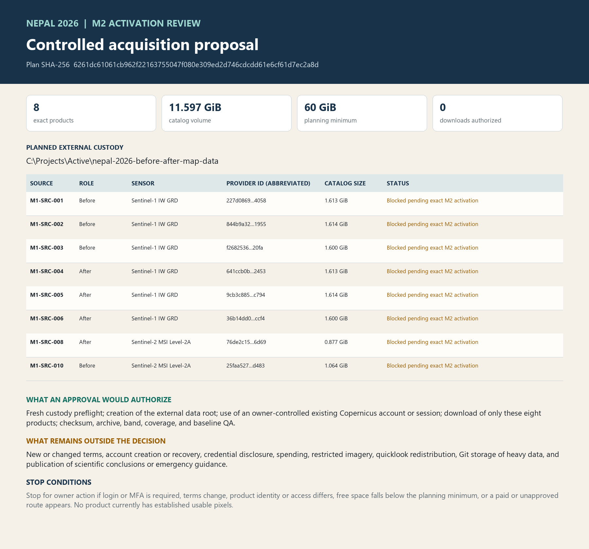

# M2 controlled-acquisition activation review

**Decision status:** Prepared for owner review. M2 is not active and no acquisition is authorized.

**Candidate plan SHA-256:** `6261dc61061cb962f22163755047f080e309ed2d746cdcdd61e6cf61d7ec2a8d`

## Decision requested

Choose **approve**, **revise**, or **defer** for the exact plan above. Approval would authorize a fresh custody preflight, creation of the external data root, use of an owner-controlled existing Copernicus Data Space account or authenticated session, download of only the eight exact products below, and integrity, pixel, rights, coverage, and baseline QA.

Approval would **not** accept new or changed terms, create or recover an account, disclose credentials, incur cost, redistribute portal quicklooks, use restricted high-resolution imagery, store heavy data in Git, or publish scientific conclusions or emergency guidance.

## Exact proposed acquisition set

| Source | Role | Sensor | Exact product | Catalog GiB |
|---|---|---|---|---:|
| M1-SRC-001 | before | Sentinel-1 IW GRD | `S1D_IW_GRDH_1SDV_20260816T122116_20260816T122141_004151_007980_B057.SAFE` | 1.613 |
| M1-SRC-002 | before | Sentinel-1 IW GRD | `S1D_IW_GRDH_1SDV_20260816T122141_20260816T122206_004151_007980_C3AB.SAFE` | 1.614 |
| M1-SRC-003 | before | Sentinel-1 IW GRD | `S1D_IW_GRDH_1SDV_20260819T001036_20260819T001101_004187_007ABD_DC16.SAFE` | 1.600 |
| M1-SRC-004 | after | Sentinel-1 IW GRD | `S1D_IW_GRDH_1SDV_20260828T122116_20260828T122141_004326_007FA4_C523.SAFE` | 1.613 |
| M1-SRC-005 | after | Sentinel-1 IW GRD | `S1D_IW_GRDH_1SDV_20260828T122141_20260828T122206_004326_007FA4_01B4.SAFE` | 1.614 |
| M1-SRC-006 | after | Sentinel-1 IW GRD | `S1D_IW_GRDH_1SDV_20260831T001037_20260831T001102_004362_0080EC_2C5B.SAFE` | 1.600 |
| M1-SRC-008 | after | Sentinel-2 MSI Level-2A | `S2B_MSIL2A_20260827T045659_N0512_R119_T45RUM_20260827T084453.SAFE` | 0.877 |
| M1-SRC-010 | before | Sentinel-2 MSI Level-2A | `S2C_MSIL2A_20260812T045701_N0512_R119_T45RUM_20260812T100317.SAFE` | 1.064 |

Planned total: **11.597 GiB** by provider catalog metadata. The plan requires at least **60 GiB** free before acquisition as a conservative planning minimum.

## Custody boundary

The proposed external root is `C:\Projects\Active\nepal-2026-before-after-map-data`. It has not been created by this milestone package. Raw archives, SAFE products, rasters, geodatabases, credentials, and tokens remain outside the public Git repository.

Every later authorized product intake must preserve exact provider identity, declared checksums, local SHA-256, byte size, transfer status, archive integrity, and any failed or partial attempt. Promotion to analysis custody requires a passing verification record.

## Mandatory stops

- Stop for owner action if login, multi-factor authentication, or account recovery is required.
- Stop if provider terms are new or changed or require acceptance.
- Stop if product identity, size, checksum, entitlement, or access route differs from the exact plan.
- Stop if free space falls below the recorded planning minimum or a paid route appears.
- Stop before any public scientific claim or emergency guidance.

## Known limitations

- No full-product bytes are in custody and no acquisition has begun.
- Catalog sizes can differ from transferred or extracted sizes.
- Approved source dispositions do not establish usable pixels, registration quality, masks, radar geometry, or event change.
- The post-event optical route is high-cloud-risk and may remain inconclusive.

## Exact approval wording

After reviewing the bound bundle, the owner may respond:

> I approve M2 activation review bundle `<bundle SHA-256>` and acquisition plan `6261dc61061cb962f22163755047f080e309ed2d746cdcdd61e6cf61d7ec2a8d`. I authorize only the bounded actions stated in the reviewed plan. I attest this is my completed decision.

Replace `<bundle SHA-256>` with the exact bundle hash published after validation.
