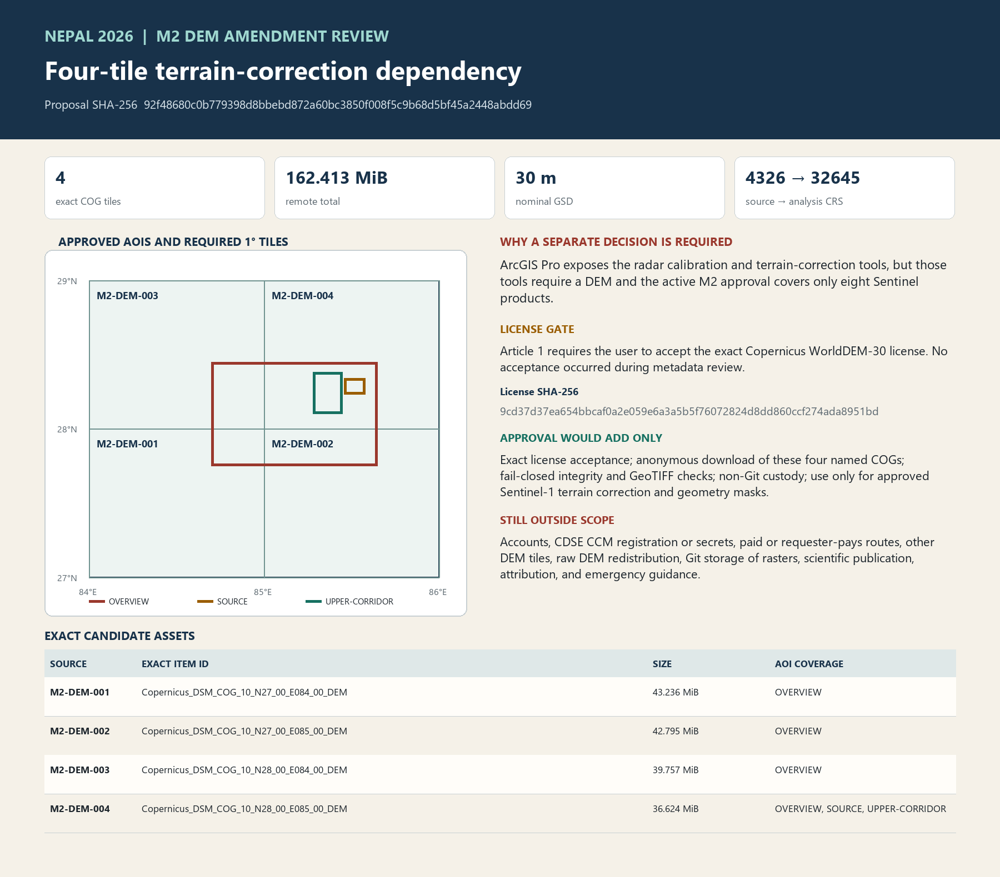

# M2 DEM dependency amendment review

**Decision status:** Prepared for owner review. The amendment is not active, the Copernicus WorldDEM-30 license has not been accepted, and no DEM payload bytes have been requested.

**Candidate manifest SHA-256:** `1fb1b96f4bb3e42b77b4638d7ea36f13685eb29dec7e01a63c27acfc56786243`

**Amendment proposal SHA-256:** `92f48680c0b779398d8bbebd872a60bc3850f008f5c9b68d5bf45a2448abdd69`

**License document SHA-256:** `9cd37d37ea654bbcaf0a2e059e6a3a5b5f76072824d8dd860ccf274ada8951bd`

## Why this amendment exists

The installed ArcGIS Pro 3.7.1 Image Analyst runtime provides Sentinel-1 radiometric calibration, terrain flattening, radiometric terrain correction, geometric terrain correction, masking, unit conversion, and despeckling tools. The terrain-correction signatures accept or require an input DEM.

The active M2 contract authorizes only eight exact Sentinel products. It does not identify an elevation source and expressly forbids additional products and new terms acceptance. A DEM cannot be added by inference because it changes both the acquisition set and the legal boundary.

## Exact proposed DEM source

The candidate is the public Copernicus DEM GLO-30 Cloud Optimized GeoTIFF distribution. It is a **digital surface model**, so heights may include buildings, infrastructure, and vegetation. Its proposed role is limited to Sentinel-1 terrain correction and terrain-geometry screening; it is not proposed as evidence of elevation change.

The approved AOIs span longitude 84.70–85.65°E and latitude 27.75–28.45°N. Their union intersects four exact 1° tiles:

| Source | Exact STAC item and COG identity | WGS 84 tile bbox | Approved AOIs intersected | Remote bytes |
|---|---|---|---|---:|
| `M2-DEM-001` | `Copernicus_DSM_COG_10_N27_00_E084_00_DEM` | 84–85°E, 27–28°N | Overview | 45,336,691 |
| `M2-DEM-002` | `Copernicus_DSM_COG_10_N27_00_E085_00_DEM` | 85–86°E, 27–28°N | Overview | 44,874,244 |
| `M2-DEM-003` | `Copernicus_DSM_COG_10_N28_00_E084_00_DEM` | 84–85°E, 28–29°N | Overview | 41,688,284 |
| `M2-DEM-004` | `Copernicus_DSM_COG_10_N28_00_E085_00_DEM` | 85–86°E, 28–29°N | Overview, source, upper corridor | 38,402,839 |

The four remote objects total **170,302,058 bytes (162.413 MiB)**. Live metadata review found each item in the official CDSE STAC collection and each exact object through anonymous HTTPS in the AWS Registry of Open Data mirror. The route requires no AWS account. These checks establish metadata identity and availability only; they do not establish transferred-byte integrity or usable terrain pixels.

## Exact license decision

The reviewed document is **Licence for Copernicus DEM instance COP-DEM-GLO-30-F Global 30m Full, Free & Open**, available from the official CDSE documentation at:

<https://documentation.dataspace.copernicus.eu/APIs/SentinelHub/Data/DEM/resources/license/License-COPDEM-30.pdf>

Article 1 requires user acceptance. The license grants worldwide, time-unlimited rights to reproduce, distribute, communicate, adapt, modify, and combine the DEM without charge. It also requires specific source and produced-using notices, a prescribed no-liability notice for public distribution or communication, no implication of official endorsement, and propagation of obligations to downstream distributors.

Approval of this amendment would record acceptance of only the exact hash-bound license above. If its bytes or published obligations differ at the acquisition preflight, work must stop for a new review.

## What approval would authorize

- Accept the exact license document identified above.
- Download only the four exact COG assets from the anonymous HTTPS URLs in the bound candidate manifest.
- Refuse redirects, authentication, account registration, generated secrets, requester-pays behavior, and any cost.
- Stage and promote files without replacement in versioned non-Git custody under `C:\Projects\Active\nepal-2026-before-after-map-data`.
- Verify remote identity metadata, byte length, local SHA-256, GeoTIFF readability, CRS, dimensions, nodata behavior, and AOI coverage before use.
- Use passing DEM pixels only for the already approved Sentinel-1 terrain-correction route and terrain-geometry exclusion masks.
- Retain every failed, partial, corrupt, superseded, excluded, and inconclusive attempt.

## What would remain outside the decision

- Any account creation, CCM registration, authentication, recovery, MFA, or generated S3 secret.
- Any paid, requester-pays, redirecting, or commercial access route.
- Any DEM tile beyond the exact four named above.
- Raw DEM redistribution, Git storage of rasters, or a repository-license decision.
- Publication of scientific conclusions, event attribution, emergency guidance, or a final ArcGIS package.
- Any claim that metadata availability proves pixel fitness, processing success, landscape change, or causation.

## Mandatory stops

- Stop if the exact license hash or obligations differ.
- Stop if any tile identity, URL, bbox, byte length, ETag, last-modified value, access mode, or cost differs at fresh preflight.
- Stop if an account, credentials, new terms prompt, requester-pays mode, redirect, or paid route appears.
- Stop on an unsafe path, collision, symlink, or non-atomic promotion risk.
- Stop and preserve the attempt if any file fails size, local SHA-256 capture, GeoTIFF readability, CRS, dimension, nodata, or AOI-coverage validation.

## Exact approval wording

After reviewing the complete hash-bound bundle, the owner may respond:

> I approve M2 DEM amendment review bundle `<bundle SHA-256>` and amendment proposal `92f48680c0b779398d8bbebd872a60bc3850f008f5c9b68d5bf45a2448abdd69`. I accept the exact Copernicus WorldDEM-30 license document `9cd37d37ea654bbcaf0a2e059e6a3a5b5f76072824d8dd860ccf274ada8951bd` and authorize only the bounded four-tile acquisition, verification, custody, and radar-processing actions stated in the reviewed proposal. I attest this is my completed decision.

Replace `<bundle SHA-256>` with the exact bundle hash published after validation.
