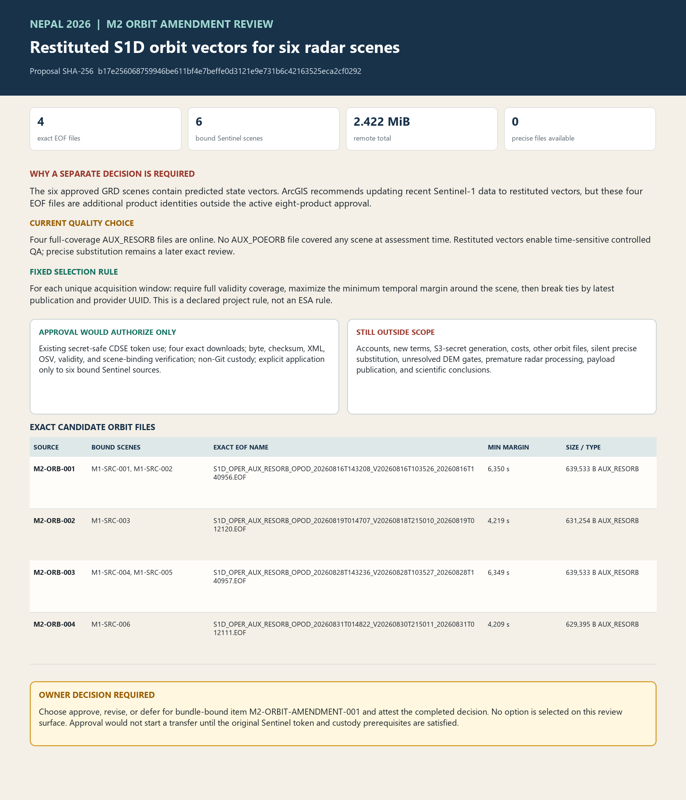

# M2 Sentinel-1 orbit amendment review

**Decision status:** Prepared for owner review. The amendment is not active, no orbit payload has been requested, and no credential value has been read or recorded.

**Candidate manifest SHA-256:** `e5c0222213a0215cc600ac5e3ef402078b912fa87ff0f523ba362d73f84d3736`

**Amendment proposal SHA-256:** `b17e256068759946be611bf4e7beffe0d3121e9e731b6c42163525eca2cf0292`

**Sentinel Data Legal Notice SHA-256:** `fa2955ff48a1d82e77fc7296d63681670ecdb9d2811a0505ae60d0683b62fa64`

## Why this amendment exists

The six approved Sentinel-1D GRD products contain predicted orbit state vectors. Current ArcGIS Pro guidance recommends updating Sentinel-1 GRD data to restituted or precise vectors when available. `ApplyOrbitCorrection` can apply one explicit external EOF file, while the `DownloadOrbitFile` route uses Copernicus Data Space credentials.

The active M2 approval covers only eight exact Sentinel image products. Orbit EOF files are additional product identities, so they cannot be downloaded or applied by inference even though they are small and governed by the same Sentinel legal notice.

## Current official evidence

On 4 September 2026, public CDSE OData queries found multiple S1D `AUX_RESORB` files whose validity intervals fully cover each unique radar acquisition window. No `AUX_POEORB` file yet covered any of the four windows. This matches official timing guidance: restituted vectors arrive within hours, while precise vectors normally arrive about 20 days to three weeks after acquisition.

The proposed route selects one restituted file per unique acquisition window using a fixed rule: among all full-coverage candidates, choose the file with the largest minimum time margin around the complete scene window; break ties by latest publication time and provider UUID. This is a project selection rule designed to avoid edge-of-validity use. It is not represented as an ESA selection rule.

| Source | Bound Sentinel sources | Exact provider UUID | Minimum time margin | Bytes |
|---|---|---|---:|---:|
| `M2-ORB-001` | `M1-SRC-001`, `M1-SRC-002` | `d4fdc474-0069-459b-9534-b5999dec5aab` | 6,350 s | 639,533 |
| `M2-ORB-002` | `M1-SRC-003` | `ec7dd79b-0588-456a-9d17-6324d5affcb5` | 4,219 s | 631,254 |
| `M2-ORB-003` | `M1-SRC-004`, `M1-SRC-005` | `182fec80-86b8-46b4-bc76-43be0ab70ba5` | 6,349 s | 639,533 |
| `M2-ORB-004` | `M1-SRC-006` | `af27071d-df96-4850-af40-e09aedcd68a3` | 4,209 s | 629,395 |

The four EOF files total **2,539,715 bytes (2.422 MiB)**. The exact filenames, validity intervals, publication dates, S3 paths, eviction dates, MD5 values, BLAKE3 values, and provider download URLs are bound in `records/source-gates/m2-orbit-candidate-manifest.json`.

## Quality boundary

The proposed files are **restituted**, not precise. Copernicus documents a 10 cm two-dimensional RMS requirement for AUX_RESORB and a 5 cm three-dimensional RMS requirement for AUX_POEORB. ArcGIS recommends restituted vectors for acquisitions less than three weeks old and precise vectors after they become available.

Approval would allow the project to proceed with the time-sensitive restituted route after the matching Sentinel archives enter verified custody. It would not represent restituted vectors as precise, prove geolocation or registration accuracy, or silently authorize later precise files. A later precise substitution requires a new exact manifest and review.

## What approval would authorize

- Use the existing owner-controlled CDSE token only through the already-open secret-safe reference after the original Sentinel acquisition begins.
- Download only the four exact provider UUIDs in the bound manifest.
- Fail closed on changed identity, size, checksums, validity, access host, online state, eviction date, or terms.
- Verify provider size, MD5, BLAKE3, local SHA-256, safe XML parsing, S1D and AUX_RESORB identity, ordered finite state vectors, units, validity coverage, and exact scene binding.
- Store EOF payloads and corrected metadata only in versioned non-Git custody.
- Apply each passing EOF only to the exact Sentinel sources listed in its record, preserving the original predicted metadata and every failed or superseded attempt.

## What would remain outside the decision

- Account creation, recovery, MFA, new terms acceptance, generated S3 credentials, secret disclosure, payment, or an unapproved host.
- Any orbit file other than the four exact restituted objects above.
- Automatic substitution of later `AUX_POEORB` files.
- Resolution of the DEM vertical-datum gate or terrain-result review.
- Radar pixel processing before Sentinel custody, container, pixel-readiness, DEM, vertical, and orbit prerequisites all pass.
- Publication of orbit payloads, scientific conclusions, attribution, emergency guidance, or a final ArcGIS package.

## Mandatory stops

- Stop if the exact manifest, proposal, legal-notice, or current terms hashes differ at fresh preflight.
- Stop if the existing token reference is absent, expired, invalid, or would need to be disclosed or logged.
- Stop on login, MFA, recovery, terms acceptance, S3-key generation, payment, or an unapproved redirect.
- Stop on a collision, unsafe path, symlink, reparse point, overwrite, or ambiguous prior attempt.
- Stop and retain the attempt if any EOF fails identity, size, checksum, XML, mission, file type, state-vector, unit, validity, or scene-binding checks.

## Exact approval wording

After reviewing the complete hash-bound bundle, the owner may respond:

> I approve M2 Sentinel-1 orbit amendment review bundle `<bundle SHA-256>` and amendment proposal `b17e256068759946be611bf4e7beffe0d3121e9e731b6c42163525eca2cf0292`. I authorize only the four exact S1D AUX_RESORB acquisitions, verification, non-Git custody, and exact-source application actions stated in the reviewed proposal, using the existing secret-safe owner-controlled CDSE token reference. I understand these are restituted rather than precise orbit files and that later precise substitution remains separately gated. I attest this is my completed decision.

Replace `<bundle SHA-256>` with the exact bundle hash published after validation.
